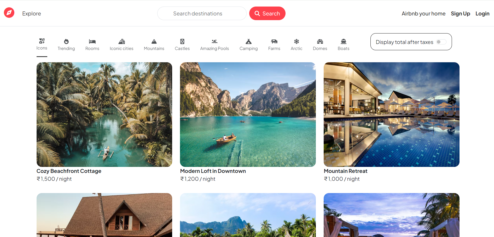
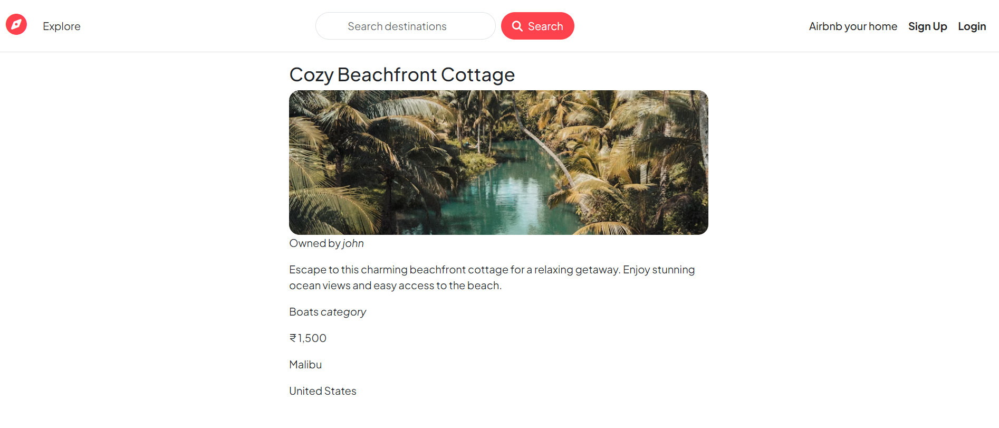
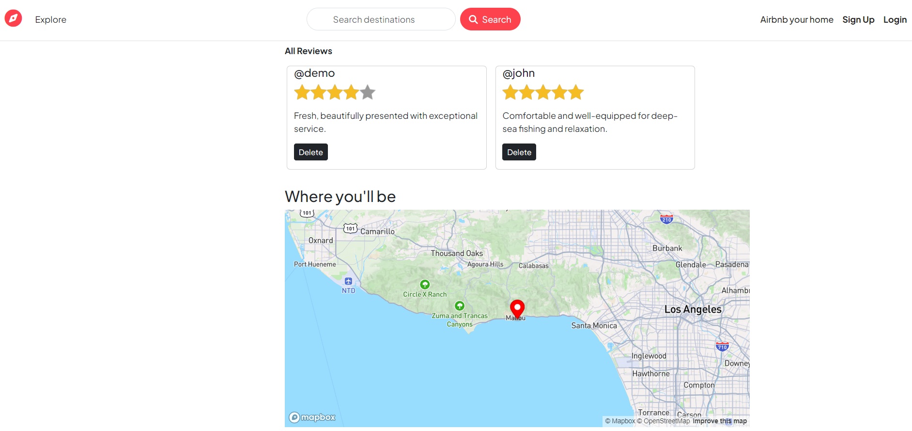

# Wanderlust

Wanderlust is a web application that allows users to browse and book unique accommodations worldwide. From beachfront villas to mountain retreats, Wanderlust offers a wide range of options for travelers seeking memorable stays.

## Table of Contents

1. [Features](#features)
2. [Deployment](#deployment)
3. [Tech Stack](#tech-stack)
4. [Project Highlights](#project-highlights)
5. [Conclusion](#conclusion)

## Features

- **Browse Listings**: View a curated selection of unique accommodations with high-quality images and detailed descriptions.
- **Search Functionality**: Filter listings based on location, country, category and more to find the perfect stay.
- **Detailed Descriptions**: Each listing provides comprehensive details including photos, location, and pricing.
- **Map View**: View the exact location of listings on an interactive map.
- **User Authentication**: Sign up and log in to access personalized features and book accommodations.
- **Responsive Design**: The application is optimized for seamless use on both desktop and mobile devices.

## Deployment
The website has been deployed on [Render](https://render.com/), and it can be accessed through this link: [https://wanderlust-oxf5.onrender.com/listings](https://wanderlust-oxf5.onrender.com/listings)

## Tech Stack

- **Frontend**: HTML, CSS, Bootstrap, JavaScript
- **Backend**: Node.js, Express.js
- **Database**: MongoDB
- **Hosting**: Render

## Project Highlights
 Here are some screenshots of the project:

## Conclusion

Wanderlust serves as a comprehensive project for learning web development, encompassing both frontend and backend technologies. It provides practical experience in creating a responsive and interactive web application, handling user authentication, and integrating third-party services like maps. By deploying the project, developers can also gain insights into cloud hosting and continuous deployment. This project is an excellent resource for anyone looking to enhance their full-stack development skills.